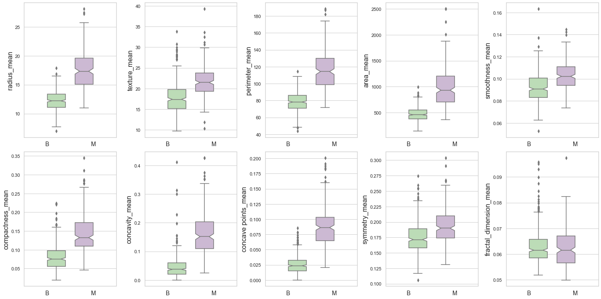
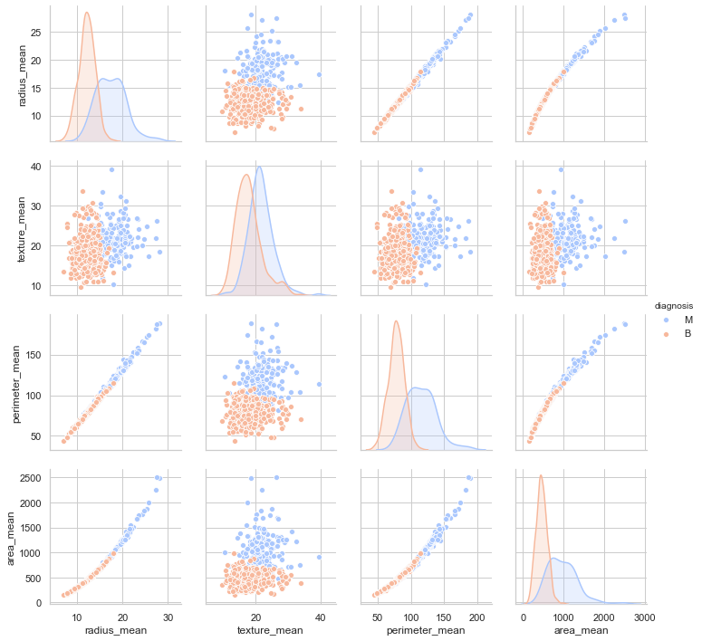
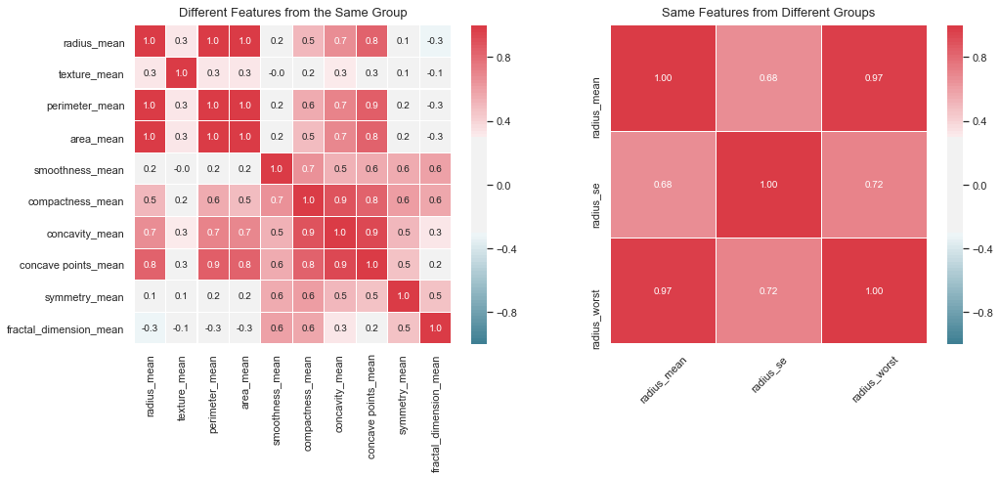
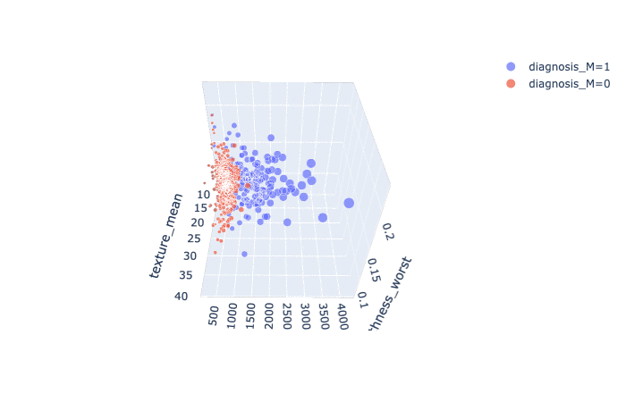

# kaggle-breast-cancer-uci-diagnosis-data-set

## Executive Summary

## Folder Organization
```
    |-- code
         |-- part_1_data_cleaning_&_eda.ipynb
         |-- part_2_reproduce_legacy_model_with_svm.ipynb
         |-- part_3_alternative_model_approach.ipynb
    |-- data
         |-- data.csv
    |-- images
    |-- DECK_classify_malignant_cell_from UCI_breast_Cancer_(Diagnosis)_dataset.pdf
    |-- README.MD
```

### 1. State the Problem
To classify breast cancer cell based on the features computed from digitized image of a fine needle aspiration of a breast mass. These features describe chracteristics of teh cell nuclei presented in the image.

### 2. Obtain Data
The **Breast Cancer Wisconsin (Diagnostic) Dataset** was obtain from [Kaggle.com](https://www.kaggle.com/uciml/breast-cancer-wisconsin-data). The original data was created by Dr. William H. Wolberg (General Surgey Dept), Prof. W. Nick Street (Computer Sciences Dept.), and Prof. Olvi L. Mangasarian (Computer Sciences Dept.) of University of Wisconsin and donated by Prof. Nick Street in 1994.

### 3. Describe and Clean Data
Ten real-valued features are computed for each cell nuclues:

1. radius: mean of distance from center to points on the perimeter
2. texture: standard deviation of gray-scale values
3. perimeter
4. area
5. smoothness: local variation in radius lengths
6. compactness: perimeter^2 / area - 1.0
7. concavity: severity of concave portions fo the contour
8. concave points: number of concave portions of the contour
9. symmetry
10. fracal dimension: coastline approximation -1

The mean, standard error and "worst" or largest (mean of the three largest values) of these features were computed for each image, resulting in 30 features. **The data are clean and there are no missing values**.

### 4. Explore Data
Training set are explored through following data visualization techniques:
1. **Boxplot**: visualize the difference between malignant and benign cell for a single feature. Except 'fractal_dimension_mean', malignant cell has higher median and max values than benign cells for every features. Outliers are observed. Since these outliers are not invalid data, they will not be removed for this Project.


2. **Pairplot**: explore the difference between malignant and benign cell with two features combined.


3. **Heatmap**: explore the co-linearity among features. Radius, area, and perimeter are perfectly correlated as expected. About 50% of the features have strong correlation among each other (i.e., correlation coefficient > 0.5).


4. **3D-plot**: explore the difference between malignant and benign cell with three features combined. Used the three features (i.e., smoothness_worst, texture_mean, and area_worst) selected in the 1994 paper.


### 5. Model Data
#### 5.1 Feature Selection (Classic Model)
#### 5.2 Feature Extraction
#### Support Vector Machine
### 6. Evalute Model
### 7. Recommendation & Next Step