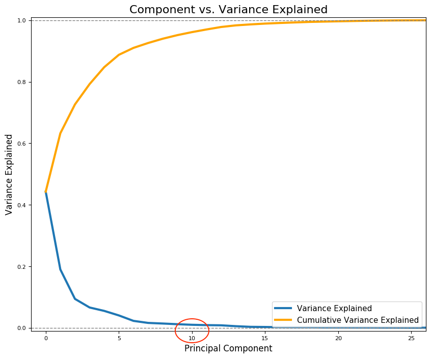

# kaggle-breast-cancer-uci-diagnosis-data-set

## Executive Summary
This is my capstone project at General Assembly’s Data Science Immersive program. I built machine learning (ML) models to classify breast cancer used in a ML paper published by the UCI professors in 1994. After studying the paper, I reproduced the model using support vector machine with the same feature selection and achieved the identical accuracy of 97.5%. Then, I rebuilt the model using deep neural network algorithm with feature extraction mechanism and further improved upon the accuracy achieved in the paper. A common and impactful data-leakage mistake during data cross-validation, for which I published my finding with a straight-forward solution on [TowardsDataScience.com](https://towardsdatascience.com/pre-process-data-with-pipeline-to-prevent-data-leakage-during-cross-validation-e3442cca7fdc).

## Repo Structure
```
    |-- code
         |-- part_1_data_cleaning_&_eda.ipynb
         |-- part_2_reproduce_legacy_model_with_svm.ipynb
         |-- part_3_alternative_model_approach.ipynb
    |-- data
         |-- data.csv
    |-- images
         |-- part_1_-_boxplot_mean.png
         |-- part_1_-_heatmap.png
         |-- part_1_-_pairplot.png  
         |-- part_2_-_3d_plot.gif 
         |-- part_3_-_PCA_2.png
    |-- DECK_classify_malignant_cell_from UCI_breast_Cancer_(Diagnosis)_dataset.pdf
    |-- README.MD
```

### 1. State the Problem
To classify breast cancer cell based on the features computed from digitized image of a fine needle aspiration of a breast mass. These features describe chracteristics of teh cell nuclei presented in the image.

### 2. Obtain Data
The **Breast Cancer Wisconsin (Diagnostic) Dataset** was obtain from [Kaggle.com](https://www.kaggle.com/uciml/breast-cancer-wisconsin-data). The original data was created by Dr. William H. Wolberg (General Surgey Dept), Prof. W. Nick Street (Computer Sciences Dept.), and Prof. Olvi L. Mangasarian (Computer Sciences Dept.) of University of Wisconsin and donated by Prof. Nick Street in 1994.

### 3. Describe and Clean Data
The dataset includes 596 data points. Ten real-valued features are computed for each cell nuclues:

1. radius: mean of distance from center to points on the perimeter
2. texture: standard deviation of gray-scale values
3. perimeter
4. area
5. smoothness: local variation in radius lengths
6. compactness: perimeter^2 / area - 1.0
7. concavity: severity of concave portions fo the contour
8. concave points: number of concave portions of the contour
9. symmetry
10. fracal dimension: coastline approximation -1

The mean, standard error and "worst" or largest (mean of the three largest values) of these features were computed for each image, resulting in 30 features. **The data are clean and there are no missing values**.

### 4. Explore Data
Training set are explored through following data visualization techniques:
1. **Boxplot**: visualize the difference between malignant and benign cell for a single feature. Except 'fractal_dimension_mean', malignant cell has higher median and max values than benign cells for every features. Outliers are observed. Since these outliers are not invalid data, they will not be removed for this Project.


2. **Pairplot**: explore the difference between malignant and benign cell with two features combined. Pairplot suggests higher dimension is needed to separate malignant from benign cells.


3. **Heatmap**: explore the co-linearity among features. Radius, area, and perimeter are perfectly correlated as expected. About 50% of the features have strong correlation among each other (i.e., correlation coefficient > 0.5).


### 5. Model Data
This project has two tasks. Task 1 is to reproduce the result produced in the 1994 paper using the same feature selection mechanism and support vector machine algorithm. Task 2 is to re-build the model using feature extraction mechanism and alternative algorithms. As

#### 5.1 Feature Selection (Classic Model)
This is Task 1 of this project. Based on the mathematical formula and loss function described in the paper, the diagnostic model, multisurface method Tree (MSM-T), is analogous to Support Vector Machine. The best results were obtained with one plane the the following three features:
- extreme area,
- extreme smoothness, and
- mean texture.

**3D-plot**: explore the difference between malignant and benign cell with three features combined. Used the three features (i.e., smoothness_worst, texture_mean, and area_worst) selected in the 1994 paper. The 3d-plot was done using **Plotly**.


The model was reproduced using support vector machine algorithm and above three selected features.

#### 5.2 Feature Extraction
This is Task 2 of this project. The model was rebuilt using feature extraction mechanism through **principal component analysis** (PCA) and following algorithms:
- Logistic regression
- K-nearest neighbors
- Random forest
- Adaboost
- Support vector machine
- Neural Network

**Review of PCA**

Principal component analysis is a method of dimensionality reduction that identifies important relationships in our data (with covariance), transforms the existing data based on these relationships (with eigenvector), and then quantifies the importance of these relationships (with eigenvalue) eiso we can keep the most important relationships and drop the others!

**Why does PCA apply here**

The 30 features of the cell nuclies are consisted of 3 measures (mean, standard error, and worst) for each of the 10 features. Therefore the measures for the same features are expected to be highly correlated (e.g., the mean radius and worst radius). In addition, there are correlations among features (e.g., radius, perimeter, and area). PCA is the proper technique to address this multicollinearity problem.

Based on the Component vs. Variance Explained plot below. 10 Components explain 95% of the variance, and the model was built using 10 PCA components.



### 6. Evalute Model & Results
Because the small data size, the accuracy of the model was evaluated based on cross-validation (not train/test split) through `Pipeline` and `GridsearchCV`. See the workbook for detail.

**Algorithm**|**Accuracy**
:-----:|:-----:
Paper|97.50%
Linear regression|98.10%
KNN|96.70%
Random forest|92.30%
Adaboost|95.40%
Support vector machine|97.90%
Neural network|98.60%

### 7. Remark 
Cross-validation is a way of estimating the generalisation performance of a process for building a model. There, however, is a common mistake that the data is preprocessed (e.g., with StandardScaler and/or PCA) before fitting the GridSearchCV. This mistake would lead to biased cross-validation scores by underestimating the variance of the validation data. The solution is using **Pipeline** whenever any data preprocessor is needed. I published a [blog post on Towardsdatascience.com](https://towardsdatascience.com/pre-process-data-with-pipeline-to-prevent-data-leakage-during-cross-validation-e3442cca7fdc) that discusses this issue.